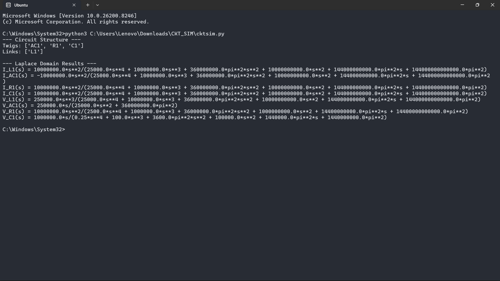

# Graph-Based Circuit Simulator (Symbolic Analysis)

A Python-based symbolic circuit analysis tool that models electrical networks using graph theory and computes branch currents and voltages in the Laplace domain.

* Graph-based modeling using NetworkX
* Cutset and tieset matrix formulation
* Symbolic Laplace-domain analysis (SymPy)
* Supports R, L, C, DC and AC sources
* Unit parsing (k, m, u, etc.)

# How to Run

pip install -r requirements.txt 
python cktsim.py

# Example netlist

AC1 1 0 10 
R1 1 2 10 
L1 2 3 25m 
C1 3 0 100u

# Outputs

* Branch currents I(s)
* Branch voltages V(s)

# Sample Output

